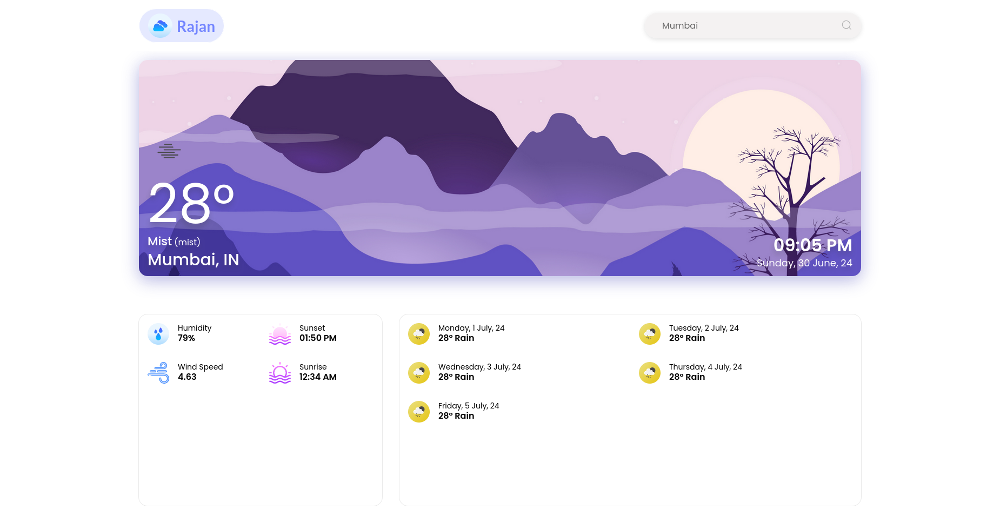
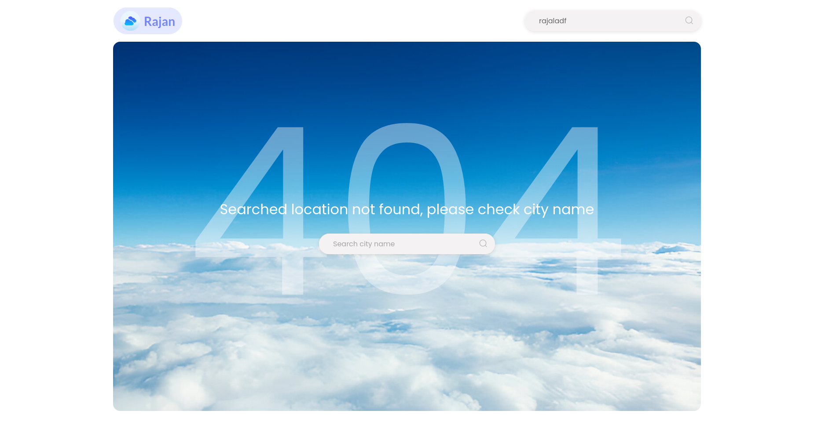

# My Next.js Weaher app Project Setup

## Screen shots




Follow the steps below to set up your Next.js project:

## Clone & Run the Repository

First, clone the repository to your local machine using the following command:

```bash
git clone <repo-url>
npm install
npm run dev
```
